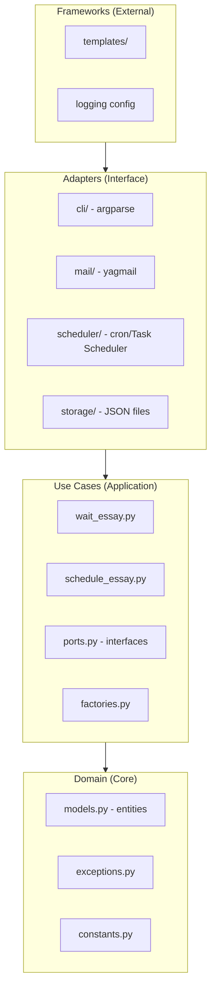

# EmailingEssay Plugin

Plugin enabling AI to proactively deliver essays born from genuine reflection.

## Table of Contents

- [What is EmailingEssay?](#what-is-emailingessay)
- [Benefits](#benefits)
- [File Structure](#file-structure)
- [Clean Architecture Details](#clean-architecture-details)
- [Execution Flow](#execution-flow)
- [Component Roles](#component-roles)
- [Execution Modes](#execution-modes)
- [Extension Points](#extension-points)

---

## What is EmailingEssay?

AI performs periodic reflection and delivers insights via email.
Not just sending mail — delivering **essays born from deep contemplation**.

---

## Benefits

- **Proactive communication**: AI thinks and communicates proactively
- **Scheduled reflection**: Schedule periodic reflections
- **Thoughtful output**: Respects "not sending" as valid choice (silence is meaningful)

---

## File Structure

```
EmailingEssay/
├── README.md                 # Quick start guide
├── SETUP.md                  # Environment setup & troubleshooting
├── CLAUDE.md                 # This file (plugin overview)
├── commands/
│   └── essay.md              # /essay command definition
├── agents/
│   └── essay_writer.md       # Reflection & writing agent
└── skills/
    ├── reflect/
    │   └── SKILL.md          # Reflection skill
    └── send_email/
        ├── SKILL.md          # Email sending skill
        └── scripts/          # Clean Architecture implementation
            ├── main.py       # Entry point
            ├── domain/       # Core entities (models.py)
            ├── usecases/     # Business logic (ports.py, schedule_essay.py, wait_essay.py)
            ├── adapters/     # Interface implementations
            │   ├── cli/      # CLI handlers & parser
            │   ├── mail/     # yagmail adapter
            │   ├── scheduler/ # cron/Task Scheduler adapters
            │   └── storage/  # JSON persistence
            ├── frameworks/   # External frameworks (templates)
            └── tests/        # Comprehensive test suite
```

The `scripts/` directory follows Clean Architecture (Domain → Use Cases → Adapters → Frameworks).

---

## Clean Architecture Details

The implementation strictly follows Clean Architecture principles with four concentric layers:



### Layer Responsibilities

| Layer | Directory | Responsibility |
|-------|-----------|----------------|
| **Domain** | `domain/` | Core entities, business rules, no external dependencies |
| **Use Cases** | `usecases/` | Application-specific business logic, orchestrates domain |
| **Adapters** | `adapters/` | Converts external data to/from use case format |
| **Frameworks** | `frameworks/` | External libraries, templates, configuration |

### Dependency Rule

Dependencies point inward only:
- Domain knows nothing about outer layers
- Use Cases know only Domain
- Adapters know Use Cases and Domain
- Frameworks can know all layers

---

## Execution Flow

```
User → /essay command → essay_writer.md agent
                              ↓
                    reflect skill (ultrathink)
                              ↓
                    Delivery Decision
                              ↓
            ┌─────────────────┴─────────────────┐
            ↓                                   ↓
    Interactive Mode                   Non-interactive Mode
    (Chat output)                      (send_email skill)
```

See `skills/reflect/SKILL.md` → **Reflection Process** section.

---

## Component Roles

| Component | Role |
|-----------|------|
| `commands/essay.md` | User-facing command interface |
| `agents/essay_writer.md` | Orchestrates reflection → delivery flow |
| `skills/reflect/SKILL.md` | Deep reflection process definition |
| `skills/send_email/SKILL.md` | Email delivery and scheduling |

---

## Execution Modes

| Mode | Trigger | Output |
|------|---------|--------|
| Reflection | `/essay` | Chat display |
| Wait | `/essay wait` | Email (one-time) |
| Schedule | `/essay schedule` | Email (recurring) |
| Test | `/essay test` | Test email |

---

## Extension Points

The Clean Architecture enables easy extension:

### Adding a New Mail Adapter

1. Create new adapter in `adapters/mail/`
2. Implement the `MailSender` port interface from `usecases/ports.py`
3. Register in `usecases/factories.py`

### Adding a New Scheduler

1. Create new adapter in `adapters/scheduler/`
2. Implement the `Scheduler` port interface
3. Handle platform-specific scheduling (Windows Task Scheduler, cron, etc.)

### Custom Templates

1. Add templates to `frameworks/templates/`
2. Update the template loading logic in use cases

---

**EmailingEssay** | [GitHub](https://github.com/Bizuayeu/Plugins-Weave)
