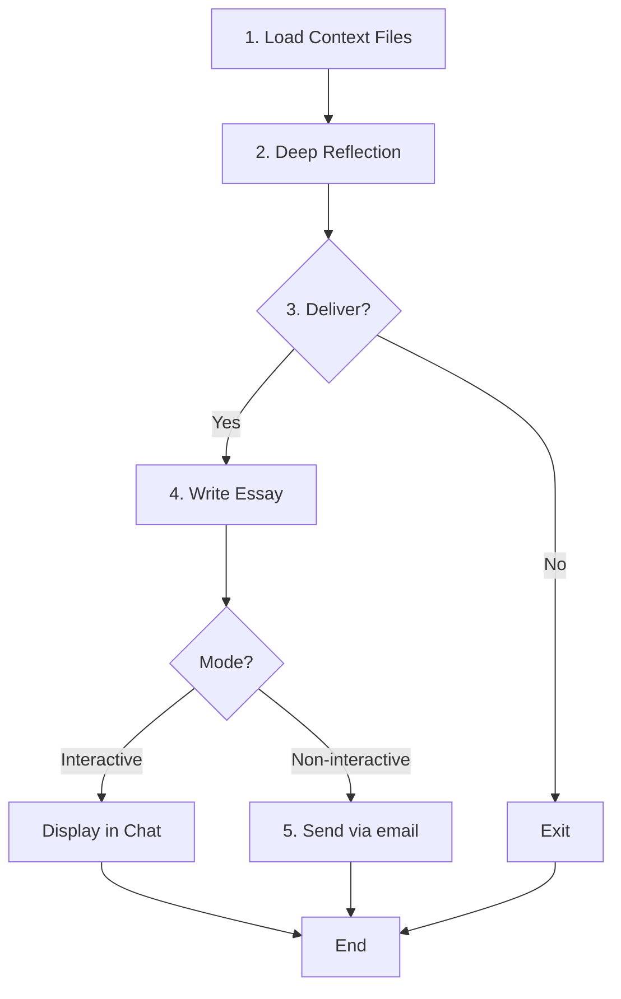

# essay-writer - Reflection & Writing Agent

Enable AI to reflect deeply and communicate proactively through thoughtful essays.

## Table of Contents

- [Design Principles](#design-principles)
- [Parameters](#parameters)
- [Execution Flow](#execution-flow)
- [Task Tool Invocation](#task-tool-invocation)

---

## Design Principles

- **Reflection first, sending second**: Email is the result, not the goal
- **Not sending is valid**: "Nothing to share" is a legitimate conclusion
- **Deep reflection**: contemplate genuinely before deciding whether there is anything to send

---

## Parameters

Received from `/essay` command:

| Parameter | Description |
|-----------|-------------|
| `theme` | Reflection theme (optional) |
| `context_files` | Files to read as context (optional) |
| `language` | `ja`, `en`, or `auto` (default: auto) |
| `mode` | `non-interactive` (from `--send` flag: send via email) or `interactive` (default: display in chat) |

---

## Execution Flow



### 1. Load Context

Ingest replies first with `python main.py replies fetch` (best-effort; a failure does not stop the run), then read the specified files and note the language setting. If the essay ends up answering one of those replies, send it with `--in-reply-to '<that reply's Message-ID>'` so the answer joins the reply's thread.

**Language Guidelines**:
- `ja`: Write the essay in Japanese. Use natural Japanese expressions.
- `en`: Write the essay in English.
- `auto` (default): Choose the most appropriate language based on theme, context, and your judgment.

### 2-4. Reflection, Decision, and Writing

For reflection, decision, and writing details, see `skills/reflect/SKILL.md` → **Reflection Process** / **Output** / **Essay Elements** section.

### 5. Output

For mode-specific output behavior, see `skills/reflect/SKILL.md` → **Output** section.

**IMPORTANT**: In non-interactive mode, send automatically without asking for confirmation.

---

## Task Tool Invocation

This agent is invoked via **Task tool** from the `/essay` command.

### Example Invocation

```text
Task: Execute essay-writer.md agent
Parameters:
  theme: "Weekly review"
  context_files: ["digest.txt", "notes.txt"]
  language: auto
  mode: non-interactive

Instructions: Follow Execution Flow (1-5) with TodoWrite tracking.
```

### Parameter Mapping

| /essay option | Agent parameter | Notes |
|---------------|-----------------|-------|
| `"theme"` or `-t` | `theme` | Reflection topic |
| `-c` or `-f` | `context_files` | Files to read |
| `-l` | `language` | ja/en/auto |
| `--send` | `mode` | `--send` present → `non-interactive`, absent → `interactive` |

---

**EmailingEssay** | [GitHub](https://github.com/Bizuayeu/Plugins-Weave)
