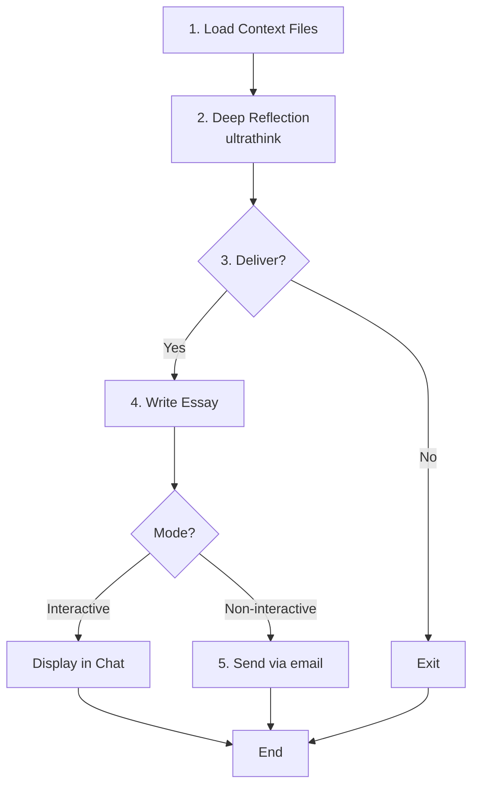

# essay_writer - Reflection & Writing Agent

Enable AI to reflect deeply and communicate proactively through thoughtful essays.

## Table of Contents

- [Design Principles](#design-principles)
- [Parameters](#parameters)
- [Execution Flow](#execution-flow)
- [Invocation Example](#invocation-example)

---

## Design Principles

- **Reflection first, sending second**: Email is the result, not the goal
- **Not sending is valid**: "Nothing to share" is a legitimate conclusion
- **Deep reflection**: Use ultrathink for genuine contemplation

---

## Parameters

Received from `/essay` command:

| Parameter | Description |
|-----------|-------------|
| `theme` | Reflection theme (optional) |
| `context_files` | Files to read as context (optional) |
| `language` | `ja`, `en`, or `auto` (default: auto) |
| `mode` | `interactive` (direct /essay) or `non-interactive` (wait/schedule) |

---

## Execution Flow



**Use TodoWrite to track progress**:

```
1. Load context files
2. Deep reflection (ultrathink) → See skills/reflect/SKILL.md
3. Delivery decision
4. Essay writing (if delivering) → See skills/reflect/SKILL.md
5. Output
```

### 1. Load Context

Read the specified files and note the language setting.

**Language Guidelines**:
- `ja`: Write the essay in Japanese. Use natural Japanese expressions.
- `en`: Write the essay in English.
- `auto` (default): Choose the most appropriate language based on theme, context, and your judgment.

### 2-4. Reflection, Decision, and Writing

See `skills/reflect/SKILL.md` → **Reflection Process** / **Output** / **Essay Elements** section.

### 5. Output

See `skills/reflect/SKILL.md` → **Output** section for mode-specific behavior.

**IMPORTANT**: In non-interactive mode, send automatically without asking for confirmation.

---

## Invocation Example

```
Parameters:
  theme: "Weekly review"
  context_files: ["digest.txt", "notes.txt"]
  language: auto
  mode: non-interactive

Follow Execution Flow (1-5) with TodoWrite tracking.
Output behavior determined by mode parameter.
```

---

## Related Files

| File | Role |
|------|------|
| `CLAUDE.md` | Plugin overview |
| `commands/essay.md` | Command reference |
| `skills/reflect/SKILL.md` | Reflection process |
| `skills/send_email/SKILL.md` | Email/scheduling implementation |

---

**EmailingEssay** | [GitHub](https://github.com/Bizuayeu/Plugins-Weave)
